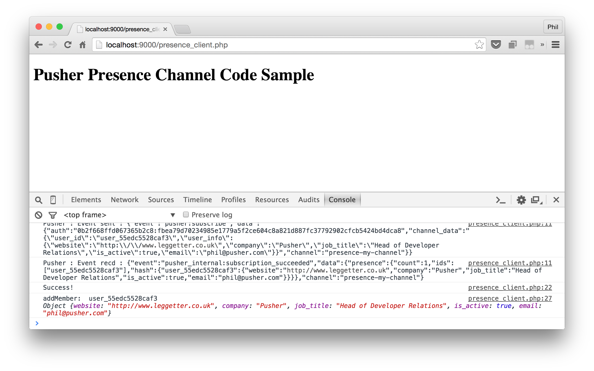

# Getting Started: Pusher PHP - No Framework

A getting started example when using the [Pusher PHP HTTP API library](https://github.com/pusher/pusher-http-php) with no PHP framework.

This repo gives you the absolute basics required to get started. It doesn't provide you with full examples so should be used as a quick getting started template or a reference.

## Examples

* [How to trigger an event from your server](src/trigger/)
* [Using Private Channels](src/private/)
* [Using Presence Channels](src/presence/)

**Todo:**

* How to receive and incoming WebHook
* How to trigger an event from your client (client events)

## Installation

From the directory you've cloned into, install the example dependencies using [Composer](https://getcomposer.org/):

```
$ composer install
```

Create a `.env` file in the root directory of the examples and set up your Pusher application credentials:

```
PUSHER_APP_ID=<YOUR_APP_ID>
PUSHER_APP_KEY=<YOUR_APP_KEY>
PUSHER_APP_SECRET=<YOUR_APP_SECRET>
```

## Run the examples

The command is expected to be run from the root directory of the examples:

```
$ php -S localhost:9000 -t src
```

Navigate to `localhost:9000` (or the URL you choose to use) and take a look at the examples. View the JavaScript console for a log from the Pusher JavaScript library.


